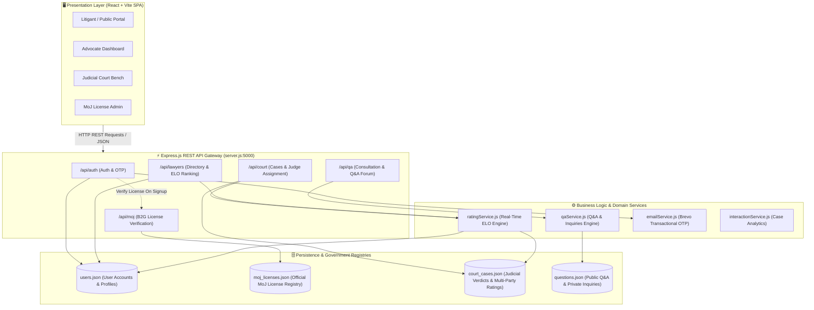
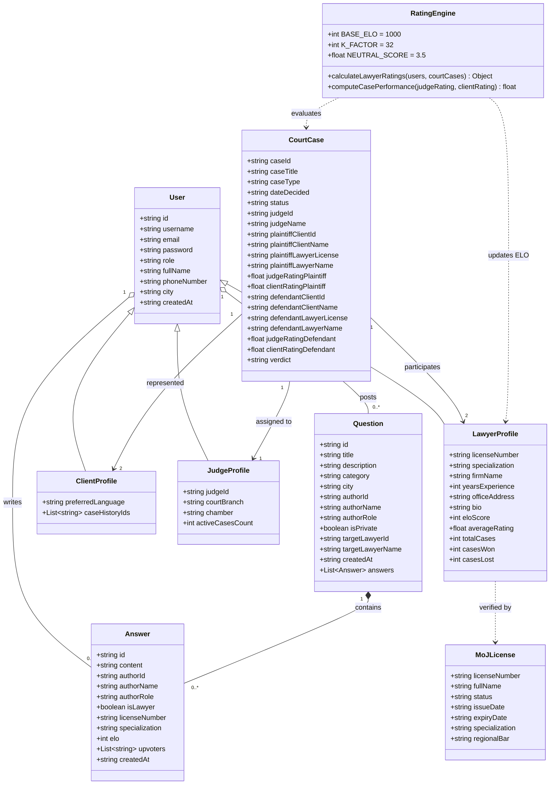
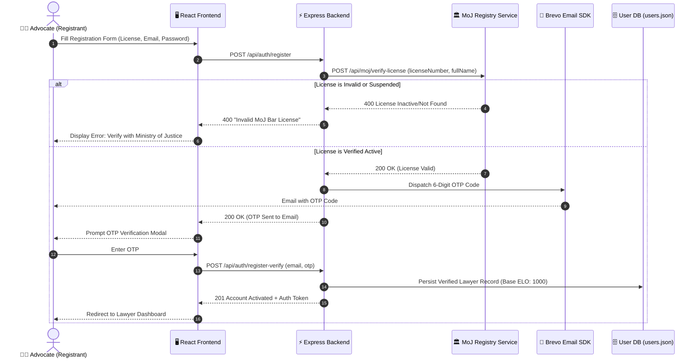
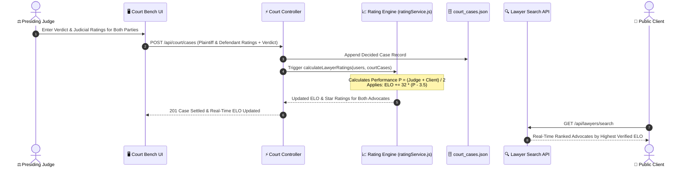

# ⚖️ EthioLaw B2G Legal Rating System (LEX-RATING)
> **Digital Legal Advocacy, Case Management & Verified B2G Rating Platform**  
> *INSA Group 9 (Room 4) — 2026 Academic Project*

---

## 👥 Project Team & Contributors

| # | Team Member | Student ID | Primary Engineering Role |
|:---:|:---|:---:|:---|
| 1 | **Lemi** | `CTC-1272-26` | **Frontend Developer** (UI/UX, Client Portal & Views) |
| 2 | **Maraky** | `CTC-2122-26` | **Backend Developer** (Q&A Service, MoJ Gateway & Logic) |
| 3 | **Kalalew** | `CTC-4154-26` | **Full Stack Developer** (System Architecture, Court APIs & ELO Engine) |
| 4 | **Liel** | `CTC-882-26` | **Frontend Developer** (Interactive Guides, Case Views & Styles) |

**🎓 Academic Supervision:** Developed under the guidance of INSA faculty and repository instructors.

---

## 📌 Executive Summary

The **EthioLaw Legal Rating & Judicial Matchmaking System (LEX-RATING)** is an integrated B2G (Business-to-Government) and B2C web platform designed specifically for the Ethiopian legal ecosystem. Inspired by global platforms like *Avvo*, the system is customized to reflect Ethiopian judicial procedures, regional jurisdictions, advocate licensing frameworks, and multi-tier court dispute lifecycles.

### Key Value Propositions
* **🛡️ Official Ministry of Justice (MoJ) B2G License Verification**: Real-time verification of practicing licenses against official Ministry registries to prevent unauthorized legal practice.
* **📈 Real-Time Multi-Party ELO Rating Algorithm**: Dynamic computation of lawyer competence ratings based on verified judicial case outcomes, judge ratings, and client feedback ($K=32$).
* **🏛️ Judicial Case Management & Judge Workload Assignment**: Federal court case registration with automated judge case distribution and real-time workload balancing.
* **💬 Legal Q&A & Private Consultation Forum**: Confidential client-to-lawyer inquiries with one-click publishing to the public community repository upon resolution.
* **📚 Ethiopian Legal Guides Knowledge Base**: Contextual resources covering Family Law, Labor Proclamations, Criminal Defense, and Commercial Code.
* **🔐 Multi-Factor Authentication via Brevo SDK**: Automated OTP verification dispatch via transactional email for zero-compromise security.

---

## 🏛️ System Architecture

The platform adopts a **layered modular architecture** decoupling the presentation layer, REST API gateway, domain service layer, and simulated government registries.



---

## 📐 Class & Domain Model Diagram



---

## 🔄 Dynamic Workflow & Sequence Diagrams

### 1. Advocate Registration & MoJ B2G Verification


### 2. Court Case Settlement & Real-Time ELO Recalculation


---

## 🧮 Real-Time ELO Rating Mathematical Engine

The LEX-RATING algorithm bridges the gap between subjective feedback and objective judicial performance. Every registered advocate starts with a neutral baseline of **`1000 ELO`**.

### 1. Case Performance Score ($P$)
For each case, performance is synthesized from the official presiding Judge rating ($R_{\text{judge}} \in [1, 5]$) and the represented Client rating ($R_{\text{client}} \in [1, 5]$):
$$P = \frac{R_{\text{judge}} + R_{\text{client}}}{2}$$

### 2. ELO Update Formula
The platform uses the international competitive standard **$K$-Factor of $32$**, calibrated against a **$3.5$ neutral baseline**:
$$\text{ELO}_{\text{new}} = \text{ELO}_{\text{old}} + \operatorname{round}\Big(32 \times (P - 3.5)\Big)$$

* **Exemplary Case ($P = 5.0$)**: $\Delta \text{ELO} = +32 \times (1.5) = \mathbf{+48\text{ ELO}}$
* **Standard Case ($P = 3.5$)**: $\Delta \text{ELO} = +32 \times (0.0) = \mathbf{0\text{ ELO}}$
* **Subpar Performance ($P = 2.0$)**: $\Delta \text{ELO} = +32 \times (-1.5) = \mathbf{-48\text{ ELO}}$

### 3. Aggregate Star Rating
$$\text{Star Rating} = \frac{1}{2N} \sum_{i=1}^{N} \big(R_{\text{judge}, i} + R_{\text{client}, i}\big)$$

---

## 📡 REST API Reference Specification

All endpoints communicate over `JSON` with standard HTTP response status codes.

### 🔐 1. Authentication & Identity (`/api/auth`)
| Method | Route | Description | Request Payload |
|---|---|---|---|
| `POST` | `/api/auth/register` | Initiates registration & sends OTP | `{ username, email, password, role, licenseNumber, ... }` |
| `POST` | `/api/auth/register-verify` | Validates OTP and creates user | `{ email, otp }` |
| `POST` | `/api/auth/login` | Authenticates user credentials | `{ email, password }` |
| `POST` | `/api/auth/resend-otp` | Re-dispatches OTP verification code | `{ email }` |
| `GET` | `/api/auth/users` | Lists registered accounts (admin view) | *None* |

### 🏛️ 2. Ministry of Justice Gateway (`/api/moj`)
| Method | Route | Description | Request Payload |
|---|---|---|---|
| `POST` | `/api/moj/verify-license` | Validates practitioner bar license | `{ licenseNumber, fullName }` |
| `GET` | `/api/moj/licenses` | Returns all official MoJ licenses | *None* |

### ⚖️ 3. Judicial Court System (`/api/court`)
| Method | Route | Description | Request Payload |
|---|---|---|---|
| `GET` | `/api/court/cases` | Retrieves judicial case records | *Query: lawyerLicense, judgeId* |
| `POST` | `/api/court/cases` | Registers verdict & party ratings | `{ caseTitle, plaintiffLawyerLicense, judgeRatingPlaintiff, ... }` |
| `GET` | `/api/court/lawyer-rating/:id`| Computes on-the-fly ELO & case stats | *URL Parameter: license number* |
| `GET` | `/api/court/judges` | Returns judges & active case counts | *None* |
| `POST` | `/api/court/assign-judge` | Balances and assigns case to judge | `{ caseId, judgeId }` |

### 🔍 4. Advocate Directory & Discovery (`/api/lawyers`)
| Method | Route | Description | Query Parameters |
|---|---|---|---|
| `GET` | `/api/lawyers/search` | Dynamic search sorted by ELO score | `specialization`, `city`, `search` |

### 💬 5. Legal Q&A & Consultations (`/api/qa`)
| Method | Route | Description | Request Payload |
|---|---|---|---|
| `GET` | `/api/qa/questions` | Fetches public community questions | `category`, `search`, `city` |
| `GET` | `/api/qa/inquiries` | Fetches direct private inquiries | `userId`, `role`, `specialization` |
| `POST` | `/api/qa/questions` | Submits public question or private inquiry | `{ title, description, isPrivate, targetLawyerId, ... }` |
| `POST` | `/api/qa/questions/:id/publish`| Author publishes private inquiry to forum| `{ userId }` |
| `POST` | `/api/qa/questions/:id/answers`| Advocate posts verified answer | `{ content, authorId, licenseNumber, ... }` |
| `POST` | `/api/qa/questions/:id/answers/:aid/upvote` | Toggles community upvote on answer | `{ userId }` |

---

## 🗄️ Database Schemas (`server/data/`)

```
server/
├── data/
│   ├── moj_licenses.json    # Official B2G MoJ practitioner registry
│   ├── court_cases.json     # Multi-party court cases, verdicts & ratings
│   ├── users.json           # User profiles (Advocates, Clients, Judges)
│   └── questions.json       # Legal consultation questions & answers
```

### Court Case Schema Sample (`court_cases.json`)
```json
{
  "caseId": "CASE-2026-001",
  "caseTitle": "Federal Prosecutor vs. Al Hashimi Trading",
  "caseType": "Criminal",
  "dateDecided": "2026-01-10",
  "status": "Decided",
  "judgeId": "JUDGE-GOV-001",
  "judgeName": "Hon. Judge Al Maktoum",
  "plaintiffClientId": "client-1",
  "plaintiffClientName": "Alex Carter",
  "plaintiffLawyerLicense": "LAW-1001",
  "plaintiffLawyerName": "John Smith",
  "judgeRatingPlaintiff": 5.0,
  "clientRatingPlaintiff": 5.0,
  "defendantClientId": "client-2",
  "defendantClientName": "Kalalew",
  "defendantLawyerLicense": "LAW-1002",
  "defendantLawyerName": "Sarah Jones",
  "judgeRatingDefendant": 4.0,
  "clientRatingDefendant": 4.2,
  "verdict": "Plaintiff"
}
```

---

## 💻 Installation & Getting Started

### 1. Prerequisites
* **Node.js** (v18.x or higher)
* **npm** (v9.x or higher)
* **Git**

### 2. Clone the Repository
```bash
git clone https://github.com/meay-luxe/INSA-Group9-Project.git
cd INSA-Group9-Project
```

### 3. Configure Environment Variables
Create a `.env` file in the project root directory:
```env
PORT=5000
BREVO_API_KEY=your_brevo_api_key_here
BREVO_SENDER_EMAIL=noreply@ethiolaw.et
BREVO_SENDER_NAME="EthioLaw Legal Platform"
```

### 4. Install Dependencies & Launch
```bash
# Install dependencies for both Frontend & Backend
npm install

# Start both Express Backend & React Vite Frontend concurrently
npm run start
```

* **Frontend UI**: `http://localhost:5173`
* **Backend API Gateway**: `http://localhost:5000`
* **API Health Check**: `http://localhost:5000/`

---

## 🌿 Collaborative Git Branching Plan

To ensure seamless multi-developer contributions without merge conflicts:

### Branch Structure
* `main` / `master` — Production-ready, stable releases.
* `court-system` — Main integration and testing branch.
* `feat/backend-auth-court` — Focus: Authentication, Court APIs, Rating Engine (*Assigned: Kalalew / Developer 1*).
* `feat/backend-qa-moj` — Focus: Q&A Service, Inquiries, MoJ Gateway (*Assigned: Maraky / Developer 2*).
* `feat/frontend-views` — Focus: React UI components, styling, guides (*Assigned: Lemi & Liel*).

### Standard Git Workflow
```bash
# 1. Sync local master/court-system branch
git checkout court-system
git pull origin court-system

# 2. Create your isolated feature branch
git checkout -b feat/your-feature-name

# 3. Stage only intentional source files (avoid staging runtime JSONs blindly!)
git add server/routes/yourRoute.js server/services/yourService.js
git commit -m "feat(court): implement automated judge case assignment"

# 4. Sync with upstream before push
git fetch origin
git pull --rebase origin court-system

# 5. Push to GitHub and create Pull Request
git push -u origin feat/your-feature-name
```

---

## 📜 Academic Disclaimer
This software was engineered as an academic demonstration for the **INSA 2026 Legal Technologies Program**. Legal guides, simulated court records, and lawyer profiles are for testing, educational, and matching purposes.
