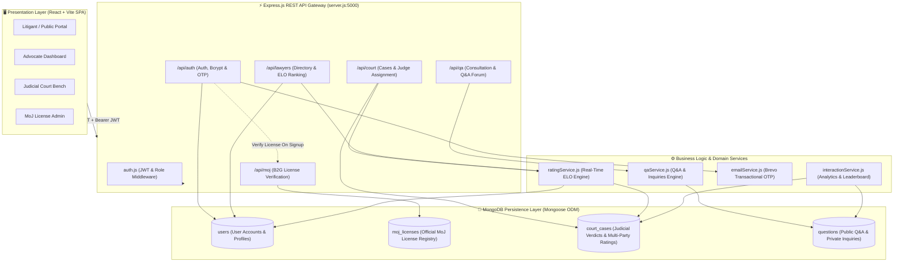
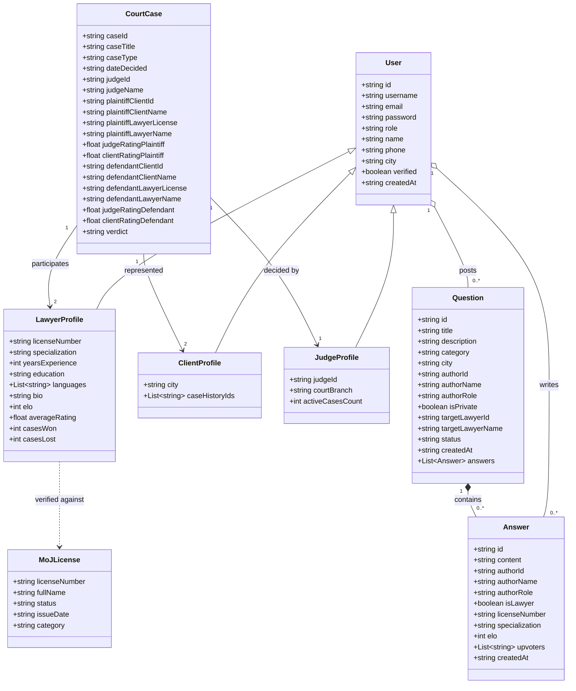

# ⚖️ EthioLaw B2G Legal Rating System (LEX-RATING)
> **Digital Legal Advocacy, Case Management & Verified B2G Rating Platform**  
> *INSA Group 9 (Room 4) — 2026 Academic Project*

---

## 👥 Project Team & Engineering Task Division

| # | Team Member | Student ID | Primary Engineering Role | Assigned Branch | Primary Modules & Files |
|:---:|:---|:---:|:---|:---:|:---|
| 1 | **Kalalew** | `CTC-4154-26` | **Backend Developer 1** | `backend/auth-court` | **Authentication, Court System & ELO Engine**<br>• `server/routes/authRoutes.js`<br>• `server/routes/courtRoutes.js`<br>• `server/routes/lawyerRoutes.js`<br>• `server/services/ratingService.js`<br>• `server/services/emailService.js`<br>• `server/middleware/auth.js`<br>• Models: `User.js`, `CourtCase.js` |
| 2 | **Maraky** | `CTC-2122-26` | **Backend Developer 2** | `backend/qa-moj` | **MongoDB Core, Legal Q&A, MoJ Gateway & Analytics**<br>• `server/config/db.js` (MongoDB Setup)<br>• `server/routes/qaRoutes.js`<br>• `server/routes/mojRoutes.js`<br>• `server/services/qaService.js`<br>• `server/services/interactionService.js`<br>• Models: `Question.js`, `MojLicense.js` |
| 3 | **Lemi** | `CTC-1272-26` | **Frontend Developer** | `frontend-structure` | **UI/UX, Navigation & Lawyer Directory**<br>• Components, Layout, Search & Filtering |
| 4 | **Liel** | `CTC-882-26` | **Frontend Developer** | `frontend-structure` | **Legal Guides, Case Views & Styles**<br>• Guide Reader Modal, Modals & Responsive CSS |

**🎓 Academic Supervision:** Developed under the guidance of INSA faculty and repository instructors.

---

## 📌 Executive Summary

The **EthioLaw Legal Rating & Judicial Matchmaking System (LEX-RATING)** is an integrated B2G (Business-to-Government) and B2C web platform designed specifically for the Ethiopian legal ecosystem. Inspired by global platforms like *Avvo*, the system is customized to reflect Ethiopian judicial procedures, regional jurisdictions, advocate licensing frameworks, and multi-tier court dispute lifecycles.

### Key Value Propositions
* **🛡️ Official Ministry of Justice (MoJ) B2G License Verification**: Real-time verification of practicing licenses against official Ministry registries to prevent unauthorized legal practice.
* **📈 Real-Time Multi-Party ELO Rating Algorithm**: Dynamic computation of lawyer competence ratings based on verified judicial case outcomes, judge ratings, and client feedback ($K=32$).
* **🏛️ Judicial Case Management & RBAC Protection**: Federal court case registration protected with Role-Based Access Control (`requireRole('judge', 'admin')`).
* **💬 Legal Q&A & Private Consultation Forum**: Confidential client-to-lawyer inquiries with one-click publishing to the public community repository upon resolution.
* **📚 Ethiopian Legal Guides Knowledge Base**: Contextual resources covering Family Law, Labor Proclamations, Criminal Defense, and Commercial Code.
* **🔐 Multi-Factor Authentication & JWT Security**: Passwords hashed with `bcrypt` (10 rounds), signed JWT token authorization, and automated OTP verification dispatch via Brevo Transactional Email.
* **🍃 Scalable MongoDB Persistence Layer**: Mongoose ODM schemas for users, court cases, Q&A consultations, and MoJ license registries.

---

## 🏛️ System Architecture



---

## 🛠️ Backend Task Division & Engineering Architecture

```
                             LEX-RATING BACKEND
                                      │
              ┌───────────────────────┴───────────────────────┐
              ▼                                               ▼
   Backend Dev 1 (Kalalew)                         Backend Dev 2 (Maraky)
  [backend/auth-court]                            [backend/qa-moj]
  ─────────────────────────────────               ─────────────────────────────────
  • User & CourtCase Models                       • MongoDB Setup (server/config/db.js)
  • JWT Auth & Bcrypt Hashing                     • Question & MoJ License Models
  • Auth Middleware (requireAuth/Role)            • Q&A Service & Endpoints
  • Court Case Registration (Judge Only)          • MoJ Registry Verification
  • ELO Rating Engine & Win-Rate Math             • Community Analytics & Leaderboard
  • Brevo Email Service & OTP Dispatch            • Seed & Data Migration Script
```

### 1. Backend Dev 1 (Kalalew) — `backend/auth-court`
* **Domain**: Authentication, Court System, Lawyer Search & ELO Rating Engine.
* **Files Assigned**:
  * `server/routes/authRoutes.js`
  * `server/routes/courtRoutes.js`
  * `server/routes/lawyerRoutes.js`
  * `server/services/ratingService.js`
  * `server/services/emailService.js`
  * `server/middleware/auth.js`
* **Mongoose Models**:
  * `User.js`: Schema for Litigants, Advocates, Judges, and Admins.
  * `CourtCase.js`: Schema for judicial proceedings, lawyer licenses, judge/client ratings, and verdicts.
* **Key Tasks**:
  * Implement MongoDB CRUD for user registration, login, and profile updates.
  * Password security using `bcrypt` (10 rounds) and JWT signing/verification.
  * OTP generation, verification, and `/resend-otp` flow using Brevo Transactional Email.
  * Role-based access control on `POST /api/court/cases` (restricted to `judge` and `admin`).
  * Dynamic ELO rating recalculation and case win/loss record aggregation in `ratingService.js`.

### 2. Backend Dev 2 (Maraky) — `backend/qa-moj`
* **Domain**: MongoDB Database Configuration, Legal Q&A, Inquiries, MoJ Gateway & Analytics.
* **Files Assigned**:
  * `server/config/db.js`
  * `server/routes/qaRoutes.js`
  * `server/routes/mojRoutes.js`
  * `server/services/qaService.js`
  * `server/services/interactionService.js`
* **Mongoose Models**:
  * `Question.js`: Schema for public questions, private consultations, sub-document answers, and upvoters.
  * `MojLicense.js`: Schema for Ministry of Justice official advocate licensing records.
* **Key Tasks**:
  * Setup MongoDB connection with Mongoose in `server/config/db.js` and initialize in `server/server.js`.
  * Create data seed/migration script to import data into MongoDB collections.
  * Migrate Q&A and private inquiries CRUD operations to MongoDB.
  * Atomic upvote toggling using MongoDB `$addToSet` / `$pull` operators.
  * Protect Q&A write endpoints with `requireAuth` middleware.
  * MoJ license validation queries in `mojRoutes.js`.
  * Advocate interaction scores and leaderboard rankings in `interactionService.js`.

---

## 📐 Class & Domain Model Diagram



---

## 🧮 Real-Time ELO Rating Mathematical Engine

The LEX-RATING algorithm bridges the gap between subjective feedback and objective judicial performance. Every registered advocate starts with a neutral baseline of **`1000 ELO`**.

### 1. Case Performance Score ($P$)
For each case, performance is synthesized from the official presiding Judge rating ($R_{\text{judge}} \in [1, 5]$) and the represented Client rating ($R_{\text{client}} \in [1, 5]$):
$$P = \frac{R_{\text{judge}} + R_{\text{client}}}{2}$$

### 2. ELO Update Formula
The platform uses the international competitive standard **$K$-Factor of $32$**, calibrated against a **$3.5$ neutral baseline**:
$$\text{ELO}_{\text{new}} = \text{ELO}_{\text{old}} + \operatorname{round}\Big(32 \times (P - 3.5)\Big)$$

* **Exemplary Case ($P = 5.0$)**: $\Delta \text{ELO} = +32 \times (1.5) = \mathbf{+48\text{ ELO}}$
* **Standard Case ($P = 3.5$)**: $\Delta \text{ELO} = +32 \times (0.0) = \mathbf{0\text{ ELO}}$
* **Subpar Performance ($P = 2.0$)**: $\Delta \text{ELO} = +32 \times (-1.5) = \mathbf{-48\text{ ELO}}$

---

## 📡 REST API Reference Specification

### 🔐 1. Authentication & Identity (`/api/auth`)
| Method | Route | Description | Auth / Role |
|---|---|---|---|
| `POST` | `/api/auth/register` | Initiates registration, hashes password & sends OTP | Public |
| `POST` | `/api/auth/register-verify` | Validates OTP and persists user | Public |
| `POST` | `/api/auth/login` | Validates credentials & returns JWT token | Public |
| `POST` | `/api/auth/resend-otp` | Re-dispatches OTP verification code | Public |

### 🏛️ 2. Ministry of Justice Gateway (`/api/moj`)
| Method | Route | Description | Auth / Role |
|---|---|---|---|
| `POST` | `/api/moj/verify-license` | Validates practitioner bar license | Public |
| `GET` | `/api/moj/licenses` | Returns official MoJ license records | Public |

### ⚖️ 3. Judicial Court System (`/api/court`)
| Method | Route | Description | Auth / Role |
|---|---|---|---|
| `GET` | `/api/court/cases` | Retrieves judicial case records | Public |
| `POST` | `/api/court/cases` | Registers verdict & party ratings | 🔒 `judge`, `admin` |
| `GET` | `/api/court/lawyer-rating/:licenseNumber` | Computes on-the-fly ELO & case stats | Public |

### 🔍 4. Advocate Directory & Discovery (`/api/lawyers`)
| Method | Route | Description | Auth / Role |
|---|---|---|---|
| `GET` | `/api/lawyers/search` | Search advocates filtered by spec, city, ELO | Public |
| `GET` | `/api/lawyers/leaderboard` | Top interactive legal practitioners | Public |

### 💬 5. Legal Q&A & Consultations (`/api/qa`)
| Method | Route | Description | Auth / Role |
|---|---|---|---|
| `GET` | `/api/qa/questions` | Fetches public community questions | Public |
| `GET` | `/api/qa/inquiries` | Fetches private client-lawyer inquiries | Public (User query) |
| `POST` | `/api/qa/questions` | Submits public question or private inquiry | 🔒 `requireAuth` |
| `POST` | `/api/qa/questions/:id/publish` | Author publishes private inquiry to forum | 🔒 `requireAuth` |
| `POST` | `/api/qa/questions/:id/answers` | Posts answer to question thread | 🔒 `requireAuth` |
| `POST` | `/api/qa/questions/:id/answers/:aid/upvote` | Toggles upvote on answer | 🔒 `requireAuth` |

---

## 💻 Installation & Getting Started

### 1. Prerequisites
* **Node.js** (v18.x or higher)
* **MongoDB** (Local instance or MongoDB Atlas connection string)
* **npm** (v9.x or higher)
* **Git**

### 2. Clone the Repository
```bash
git clone https://github.com/qalalew/EthioLaw-B2G-Legal-Rating-System.git
cd EthioLaw-B2G-Legal-Rating-System
```

### 3. Configure Environment Variables
Create a `.env` file in the project root directory:
```env
PORT=5000
MONGODB_URI=mongodb://localhost:27017/lex_rating
JWT_SECRET=your_secure_jwt_secret_key_here

# Brevo Transactional Email Service
BREVO_API_KEY=your_brevo_api_key_here
BREVO_SENDER_EMAIL=noreply@ethiolaw.et
BREVO_SENDER_NAME="EthioLaw Legal Platform"
```

### 4. Install Dependencies & Launch
```bash
# Install all dependencies
npm install

# Start both Express Backend & React Vite Frontend concurrently
npm start
```

* **Frontend UI**: `http://localhost:5173`
* **Backend API Gateway**: `http://localhost:5000`
* **API Health Check**: `http://localhost:5000/`

---

## 🌿 Collaborative Git Branching Plan

```bash
# Feature development branches
main                 # Production-ready, stable releases
├── backend/auth-court   # Backend Dev 1 (Kalalew): Auth, Court APIs, Rating Engine
├── backend/qa-moj       # Backend Dev 2 (Maraky): Q&A, MoJ Gateway, MongoDB Architecture
└── frontend-structure   # Frontend Devs (Lemi & Liel): UI/UX, Components, Styles
```

### Standard Workflow:
```bash
# 1. Sync main branch
git checkout main
git pull origin main

# 2. Checkout your assigned branch
git checkout backend/your-branch-name

# 3. Stage and commit your changes
git add server/routes/yourRoute.js server/services/yourService.js
git commit -m "feat(module): descriptive commit message"

# 4. Push to remote
git push origin backend/your-branch-name
```

---

## 📜 Academic Disclaimer
This software was engineered as an academic demonstration for the **INSA 2026 Legal Technologies Program**. Legal guides, simulated court records, and lawyer profiles are for testing, educational, and matching purposes.
