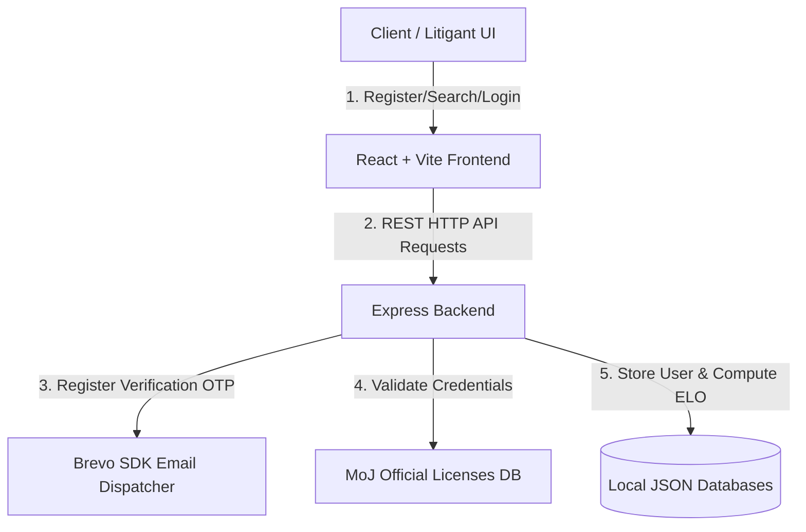

# ⚖️ Ethiopian Legal Services Platform
### INSA Group 9 (Room 4) — 2026

A web-based digital platform connecting the Ethiopian community with qualified legal professionals, transparent ratings, and accessible legal information. Inspired by global platforms like Avvo, but specifically adapted to local Ethiopian legal frameworks, locations, and practices.

---

## 👥 Team Members

| # | Name | ID | Primary Responsibility |
|---|------|----|------------------------|
| **1** | **Lemi Fayera** | `CTC-1272-26` | Frontend Developer |
| **2** | **Maraky** | `CTC-0000-26` | Backend Developer |
| **3** | **Kalalew** | `CTC-0000-26` | Full Stack Developer |
| **4** | **Liel** | `CTC-882-26` | Frontend Developer |

**🎓 Project Instructors:** Developed under the guidance of repository-assigned instructors.

---

## 📖 Project Overview

The **Ethiopian Legal Services Platform** facilitates legal accessibility across Ethiopia. It bridges the gap between litigants (Clients) and Advocates (Lawyers) by offering verified search capabilities, practice specialization sorting, and dynamic ratings.

### Key Features Implemented:
* **👤 User & Lawyer Registration**: Simplified onboarding workflow with automatic field checks.
* **🛡️ Official MoJ License Check**: Verification of lawyer registrations against the **Ministry of Justice (MoJ) official registry** to reject invalid or suspended licenses.
* **🔑 Secure Registration OTP**: Zero-compromise security flow sending verification codes automatically to the user's email address using the **Brevo Node.js SDK**.
* **📈 Hybrid ELO Rating Algorithm**: Dynamic computation of lawyer ELO ratings on-the-fly using the performance rating formula:
  $$\text{ELO}_{\text{new}} = \text{ELO}_{\text{current}} + 32 \times (\text{Case Score} - 3.5)$$
  Calculated in real-time from court records and verdicts stored in the system.
* **🔍 Specialization Filtering**: Clients can query lawyers based on practice areas (e.g. Criminal, Family, Corporate, Civil).

---

## 🏗️ Technology Stack

* **Frontend**: React (Vite environment), CSS3, JavaScript (ES6)
* **Backend**: Node.js + Express
* **Database**: Local JSON-based relational store (`users.json`, `cases.json`, `licenses.json`) simulating production MongoDB schema layouts.
* **Email Delivery**: Brevo API via official `sib-api-v3-sdk`.

---

## 🧩 Architecture Flow



---

## 🌿 Git Branching Strategy

To maintain a clean and collaborative workflow, developers **must not work directly on `main`**.

### Branch Naming Convention:
* `feature/<feature-name>` (e.g. `feature/lawyer-search`)
* `fix/<bug-name>` (e.g. `fix/login-validation`)
* `docs/<documentation-name>` (e.g. `docs/update-readme`)
* `refactor/<component-name>` (e.g. `refactor/lawyer-service`)
* `test/<test-name>` (e.g. `test/authentication-tests`)

### Commit Convention:
We adhere to standard semantic commits:
* `feat: ...` — New features
* `fix: ...` — Bug resolutions
* `docs: ...` — Document updates
* `refactor: ...` — Code refactoring
* `style: ...` — Layout, formatting, or CSS modifications

---

## 💻 Getting Started

### 1. Clone the Repository
```bash
git clone https://github.com/meay-luxe/INSA-Group9-Project.git
cd INSA-Group9-Project
```

### 2. Configure Environment Variables
Create a `.env` file in the root directory:
```env
BREVO_API_KEY=your_brevo_api_key
BREVO_SENDER_EMAIL=your-verified-email@domain.com
BREVO_SENDER_NAME="Lawyer Platform"
```

### 3. Install Dependencies & Start Services
```bash
npm install
npm run start
```
* The frontend will start on: `http://localhost:5173`
* The backend API server will run on: `http://localhost:5000`

---

## ⚠️ Disclaimer
The legal information and listings provided through the platform are intended for educational and matching purposes. It does not constitute professional legal advice.
