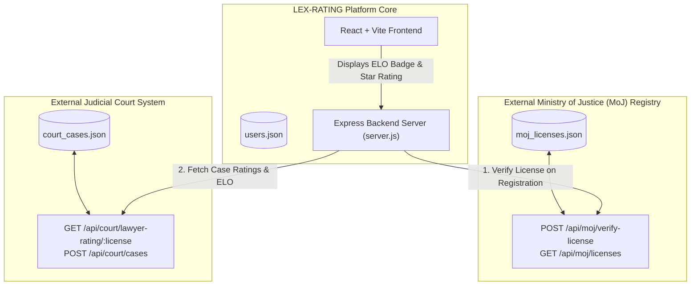

# LEX-RATING System Architecture & Documentation

## 1. System Overview & Architecture

The LEX-RATING platform connects clients with verified legal advocates and ranks lawyers using verified court case data. To simulate real-world integration with external government systems, the backend architecture was separated into **three decoupled database services** interacting via RESTful APIs:



---

## 2. Separated Database Structure (`server/data/`)

### 🏛️ 1. Ministry of Justice Registry (`server/data/moj_licenses.json`)
Stores official government-issued licenses.
* **Fields**: `licenseNumber`, `fullName`, `status`, `issueDate`, `expiryDate`, `specialization`.

### ⚖️ 2. Judicial Court System Database (`server/data/court_cases.json`)
Stores court case records involving **two lawyers** (Plaintiff Advocate & Defendant Advocate) and **two clients** (Plaintiff Client & Defendant Client).
* **Schema**:
  ```json
  {
    "caseId": "CASE-2026-001",
    "caseTitle": "Federal Prosecutor vs. Al Hashimi Trading",
    "caseType": "Criminal",
    "dateDecided": "2026-01-10",
    "judgeId": "JUDGE-GOV-001",
    "judgeName": "Hon. Judge Al Maktoum",
    
    "plaintiffClientId": "client-1",
    "plaintiffClientName": "Alex Carter",
    "plaintiffLawyerLicense": "LAW-1001",
    "plaintiffLawyerName": "John Smith",
    "judgeRatingPlaintiff": 5.0,
    "clientRatingPlaintiff": 5.0,

    "defendantClientId": "client-2",
    "defendantClientName": "Kalalew",
    "defendantLawyerLicense": "LAW-1002",
    "defendantLawyerName": "Sarah Jones",
    "judgeRatingDefendant": 4.0,
    "clientRatingDefendant": 4.2,

    "verdict": "Plaintiff"
  }
  ```

### 👤 3. Platform User Accounts (`server/data/users.json`)
Stores registered accounts for Advocates and Litigants on the LEX-RATING platform.

---

## 3. Real-Time ELO Rating System Algorithm

The server automatically computes and updates a lawyer's ELO rating in real time whenever a case containing their license ID exists or is added:

### Mathematical Formula

1. **Case Performance Score ($P$)**:
   $$P = \frac{\text{Judge Rating} + \text{Client Rating}}{2}$$

2. **Real-time ELO Score Update**:
   Every lawyer starts at a baseline of **`1000 ELO`**. The neutral performance benchmark is **`3.5`** stars ($K=32$):
   $$\text{ELO}_{\text{new}} = \text{ELO}_{\text{old}} + \text{round}\Big(32 \times (P - 3.5)\Big)$$

3. **Overall Star Rating (1.0 – 5.0 Stars)**:
   Calculated as the arithmetic mean of all performance ratings received across all cases for that lawyer ID.

4. **Analytics Storage**:
   Verdicts (`verdict`) and win/loss records (`casesWon`, `casesLost`) are stored in case records for future analytical and reporting use.

---

## 4. API Endpoints Reference (`server/server.js`)

| Method | Endpoint | Description |
|---|---|---|
| `POST` | `/api/moj/verify-license` | Authenticates license numbers and practitioner names against the official MoJ database. |
| `GET` | `/api/court/lawyer-rating/:license` | Returns computed ELO score, average star rating, and case count for a lawyer. |
| `POST` | `/api/court/cases` | Registers a new court case with 2 lawyers & 2 client ratings, triggering real-time rating updates. |
| `GET` | `/api/lawyers/search` | Queries lawyer profiles, calculates real-time ELO scores, and returns lawyers sorted by highest ELO. |
| `POST` | `/api/auth/register` | Registers a new account after authenticating lawyer license against the MoJ API. |

---

## 5. Frontend UI Features (`src/App.jsx` & `src/App.css`)

* **Clean Advocate Cards**: Displays each advocate with their specialization, average star rating (e.g. `★★★★★ (4.9)`), and an official gold **`ELO`** badge (e.g. `1134 ELO`).
* **Privacy & Simplicity**: No public court record clutter or written text feedback is exposed on the public frontend interface.
